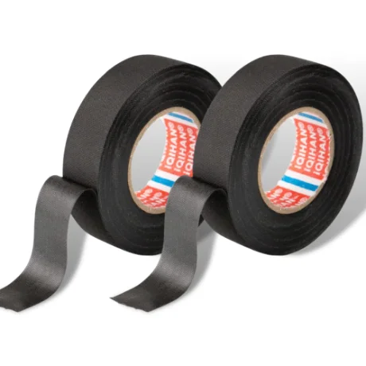
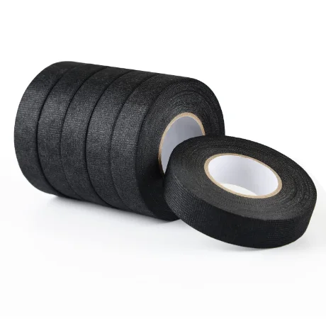
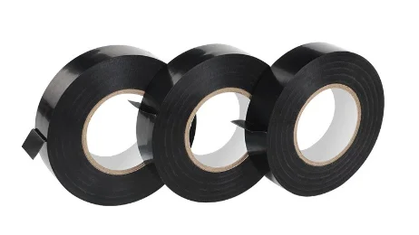
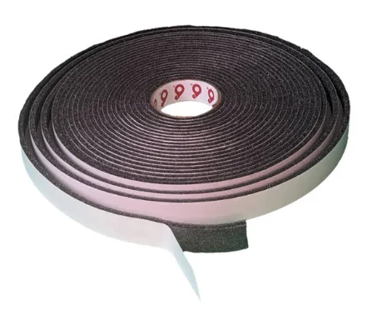
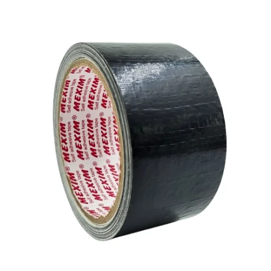
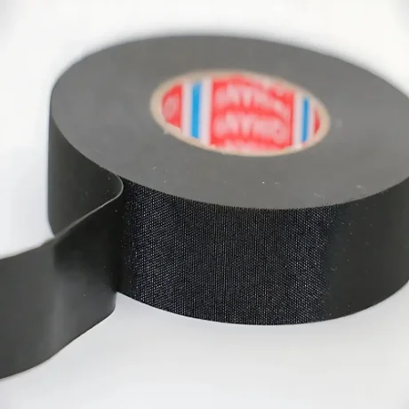

# Automotive Wire Harness Tape Comparison

A visual, engineering-focused reference comparing the six tape constructions most commonly used to wrap automotive wire harnesses — for picking the right wrap without digging through multiple supplier datasheets.

## Velvet (Flock) Tape

**Material:** PET flock fibers bonded to a woven or PVC backing, soft plush texture.
**Typical use:** Cabin-facing harness runs near trim and panels — squeak and rattle prevention.
**Temp:** -40 to 105°C · **Abrasion:** ●●●○○ · **Noise damping:** ●●●●●

## Fleece Tape

**Material:** Non-woven polyester fleece, soft matte surface, breathable.
**Typical use:** General-purpose interior bundling, standard cost-effective wrap.
**Temp:** -40 to 125°C · **Abrasion:** ●●●○○ · **Noise damping:** ●●●●○

## PVC Tape

**Material:** Plasticized PVC film, glossy or matte, flame-retardant grades common.
**Typical use:** Branch-off points, connector strain relief, general-purpose wrap.
**Temp:** -18 to 105°C · **Abrasion:** ●●●●○ · **Noise damping:** ●○○○○

## Foam Tape

**Material:** Closed-cell PE/PU foam, cushioned, single or double-sided adhesive.
**Typical use:** Vibration damping, gap filling at pass-throughs and grommets.
**Temp:** -40 to 90°C · **Abrasion:** ●●○○○ · **Noise damping:** ●●●●●

## Woven Cloth Tape

**Material:** Woven fabric coated with rubber or acrylic adhesive, high tensile strength.
**Typical use:** High-abrasion engine-bay and chassis routing, heat and chemical exposure.
**Temp:** -40 to 130°C · **Abrasion:** ●●●●● · **Noise damping:** ●●○○○

## Felt Tape

**Material:** Dense felted fiber mat, thicker than fleece, heavy cushioning.
**Typical use:** Heavy noise and vibration damping on thick harness bundles.
**Temp:** -40 to 120°C · **Abrasion:** ●●●○○ · **Noise damping:** ●●●●●

## Quick comparison table

| Tape type | Temperature range | Abrasion resistance | Noise damping | Best for |
| --- | --- | --- | --- | --- |
| Velvet (flock) | -40 to 105°C | ●●●○○ | ●●●●● | Cabin squeak/rattle prevention |
| Fleece | -40 to 125°C | ●●●○○ | ●●●●○ | General interior bundling |
| PVC | -18 to 105°C | ●●●●○ | ●○○○○ | Branch-offs, strain relief |
| Foam | -40 to 90°C | ●●○○○ | ●●●●● | Vibration damping, gap fill |
| Woven cloth | -40 to 130°C | ●●●●● | ●●○○○ | Engine bay, high-abrasion routing |
| Felt | -40 to 120°C | ●●●○○ | ●●●●● | Heavy noise/vibration damping |

*Values shown are typical reference ranges for common automotive-grade constructions and vary by manufacturer and part number — verify against the supplier datasheet before specifying. Ratings use a 5-point scale (●●●●● = highest).*

## Also available as a standalone page

[`index.html`](./index.html) — the same comparison as a self-contained web page. Open it directly in a browser, or enable GitHub Pages (Settings → Pages → Deploy from branch → `main` / root) for a shareable URL.

## Disclaimer

Specification values are typical reference ranges and vary by manufacturer and part number. Always verify against the actual supplier datasheet before specifying a tape for production use.

## License

GPL-3.0 — see [`LICENSE`](./LICENSE).

---

**N. Anorboev** — JinTing Automobile Electric LLC
[GitHub](https://github.com/nodiranor) · [LinkedIn](https://www.linkedin.com/in/naua/)
